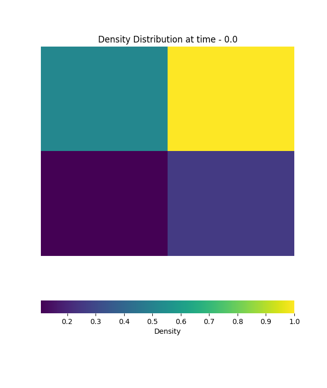

# Semidiscrete-Central-Upwind-Schemes
Semidiscrete central upwind schemes for the compressible Euler Equations. Allows for solving 2D Reimann problems for Gas Dynamics without reimann problem solvers. 

# Mesh Reading Capability
The main python script is capable of reading in a mesh, defined by Gmsh's [3] .msh (v4) file format.
Mesh topology data required for the scheme is obtained from the file and stored in the Mesh class. 
  
Following is output from the terminal to show this capability. Boundary cell indices have been 
chosen as the standard as they rely on all previous topology data to have been collected correctly.
  

# Initialisation and Plotting
The Mesh is capable of reading in vectors of primitive variables and initialising the data accordingly.
Following image is the initial density distribution given the following initial conditions and as such, 
the initialisation process is verified.
 
&nbsp;&nbsp;&nbsp;&nbsp; W1 = [&rho;1, u1. v1, p1] = [1.0, 0.0, 0.0, 1.0]
 
&nbsp;&nbsp;&nbsp;&nbsp; W2 = [&rho;2, u2. v2, p2] = [0.5197, -0.7259, 0.0, 0.4]
 
&nbsp;&nbsp;&nbsp;&nbsp; W3 = [&rho;3, u3. v3, p3] = [0.1072, -0.7259, -1.4045, 0.0439]
 
&nbsp;&nbsp;&nbsp;&nbsp; W4 = [&rho;4, u4. v4, p4] = [0.2579, 0.0, -1.4045, 0.15]
 

# Numerical Experiment Setups and Discussion
All the following numerical results have been obtained using a 100x100 mesh in a 1x1 square subected to an initial configuration listed below. 
All of the numerical experiments have been obtained from Ref. [2]. In all cases, the results lack precision due to the coarse 100x100 mesh. Simulation 
time has been a large limitation in going for more fine meshes. A refactoring of the scripts into a more suitable language like C, C++ or FORTRAN is required. 
  

# Configuration 3.
Initial Conditions: 
 
&nbsp;&nbsp;&nbsp;&nbsp; W1 = [&rho;1, u1. v1, p1] = [1.5, 0.0, 0.0, 1.5]
 
&nbsp;&nbsp;&nbsp;&nbsp; W2 = [&rho;2, u2. v2, p2] = [0.5323, 1.206, 0.0, 0.3]
 
&nbsp;&nbsp;&nbsp;&nbsp; W3 = [&rho;3, u3. v3, p3] = [0.138, 1.206, 1.206, 0.029]
 
&nbsp;&nbsp;&nbsp;&nbsp; W4 = [&rho;4, u4. v4, p4] = [0.5323, 0.0, 1.206, 0.3]
  

# Configuration 4.
Initial Conditions: 
 
&nbsp;&nbsp;&nbsp;&nbsp; W1 = [&rho;1, u1. v1, p1] = [1.1, 0.0, 0.0, 1.1]
 
&nbsp;&nbsp;&nbsp;&nbsp; W2 = [&rho;2, u2. v2, p2] = [0.5065, 0.8939, 0.0, 0.35]
 
&nbsp;&nbsp;&nbsp;&nbsp; W3 = [&rho;3, u3. v3, p3] = [1.1, 0.8939, 0.8939, 1.1]
 
&nbsp;&nbsp;&nbsp;&nbsp; W4 = [&rho;4, u4. v4, p4] = [0.5065, 0.0, 0.8939, 0.35]
  

# Configuration 5.
Initial Conditions: 
 
&nbsp;&nbsp;&nbsp;&nbsp; W1 = [&rho;1, u1. v1, p1] = [1.0, -0.75, -0.75, 1.0] 
 
&nbsp;&nbsp;&nbsp;&nbsp; W2 = [&rho;2, u2. v2, p2] = [2.0, -0.75, 0.5, 1.0]
 
&nbsp;&nbsp;&nbsp;&nbsp; W3 = [&rho;3, u3. v3, p3] = [1.0, 0.75, 0.5, 1.0] 
 
&nbsp;&nbsp;&nbsp;&nbsp; W4 = [&rho;4, u4. v4, p4] = [3.0, 0.75, -0.5, 1.0]
  

# Configuration 6.
Initial Conditions: 
 
&nbsp;&nbsp;&nbsp;&nbsp; W1 = [&rho;1, u1. v1, p1] = [1.0, 0.75, -0.5, 1.0]
 
&nbsp;&nbsp;&nbsp;&nbsp; W2 = [&rho;2, u2. v2, p2] = [2.0, 0.75, 0.5, 1.0]
 
&nbsp;&nbsp;&nbsp;&nbsp; W3 = [&rho;3, u3. v3, p3] = [1.0, -0.75, 0.5, 1.0]
 
&nbsp;&nbsp;&nbsp;&nbsp; W4 = [&rho;4, u4. v4, p4] = [3.0, -0.75, -0.5, 1.0]
  

# Configuration 8.
Initial Conditions: 
 
&nbsp;&nbsp;&nbsp;&nbsp; W1 = [&rho;1, u1. v1, p1] = [0.5197, 0.1, 0.1, 0.4]
 
&nbsp;&nbsp;&nbsp;&nbsp; W2 = [&rho;2, u2. v2, p2] = [1.0, -0.6259, 0.1, 1.0]
 
&nbsp;&nbsp;&nbsp;&nbsp; W3 = [&rho;3, u3. v3, p3] = [0.8, 0.1, 0.1, 1.0]
 
&nbsp;&nbsp;&nbsp;&nbsp; W4 = [&rho;4, u4. v4, p4] = [1.0, 0.1, -0.6259, 1.0]
  

# Configuration 9.
Initial Conditions: 
 
&nbsp;&nbsp;&nbsp;&nbsp; W1 = [&rho;1, u1. v1, p1] = [1.0, 0.0, 0.0, 1.0]
 
&nbsp;&nbsp;&nbsp;&nbsp; W2 = [&rho;2, u2. v2, p2] = [0.5197, -0.7259, 0.0, 0.4]
 
&nbsp;&nbsp;&nbsp;&nbsp; W3 = [&rho;3, u3. v3, p3] = [0.1072, -0.7259, -1.4045, 0.0439]
 
&nbsp;&nbsp;&nbsp;&nbsp; W4 = [&rho;4, u4. v4, p4] = [0.2579, 0.0, -1.4045, 0.15]
  

# Configuration 11.
Initial Conditions: 
 
&nbsp;&nbsp;&nbsp;&nbsp; W1 = [&rho;1, u1. v1, p1] = [1.0, 0.1, 0.0, 1.0]
 
&nbsp;&nbsp;&nbsp;&nbsp; W2 = [&rho;2, u2. v2, p2] = [0.5313, 0.8276, 0.0, 0.4]
 
&nbsp;&nbsp;&nbsp;&nbsp; W3 = [&rho;3, u3. v3, p3] = [0.8, 0.1, 0.0, 0.4]
 
&nbsp;&nbsp;&nbsp;&nbsp; W4 = [&rho;4, u4. v4, p4] = [0.5313, 0.1, 0.7276, 0.4]
  

# Configuration 12.
Initial Conditions: 
 
&nbsp;&nbsp;&nbsp;&nbsp; W1 = [&rho;1, u1. v1, p1] = [0.5313, 0.0, 0.0, 0.4]
 
&nbsp;&nbsp;&nbsp;&nbsp; W2 = [&rho;2, u2. v2, p2] = [1.0, 0.7276, 0.0, 1.0]
 
&nbsp;&nbsp;&nbsp;&nbsp; W3 = [&rho;3, u3. v3, p3] = [0.8, 0.0, 0.0, 1.0]
 
&nbsp;&nbsp;&nbsp;&nbsp; W4 = [&rho;4, u4. v4, p4] = [1.0, 0.0, 0.7276, 1.0]
  

# References
[1] Alexander Kurganov; Eitan Tadmor (2002). <em>Solution of two-dimensional Riemann problems for gas dynamics without Riemann problem solvers.</em> , 18(5), 584–608. doi:10.1002/num.10025  
[2] Kurganov, Alexander; Noelle, Sebastian; Petrova, Guergana  (2001). <em>Semidiscrete Central-Upwind Schemes for Hyperbolic Conservation Laws and Hamilton--Jacobi Equations.</em> SIAM Journal on Scientific Computing, 23(3), 707–740. doi:10.1137/s1064827500373413     
[3] Christophe Geuzaine; Jean-François Remacle (2009). <em>Gmsh: A 3-D finite element mesh generator with built-in pre- and post-processing facilities.</em> , 79(11), 1309–1331. doi:10.1002/nme.2579
