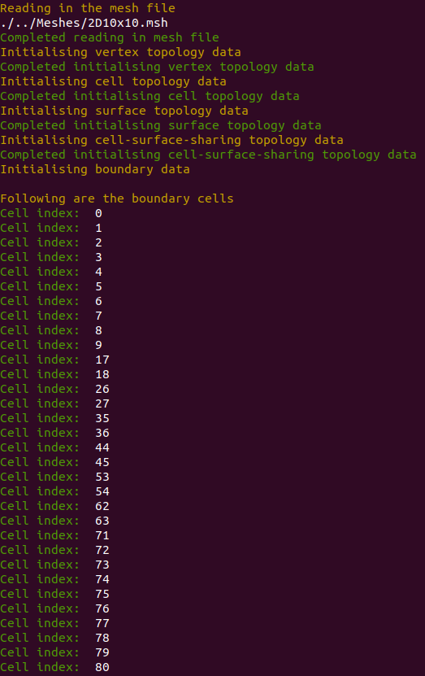

# Semidiscrete-Central-Upwind-Schemes
Semidiscrete central upwind schemes for the compressible Euler Equations. Allows for solving 2D Reimann problems for Gas Dynamics without reimann problem solvers. 

# Mesh Reading Capability
The main python script is capable of reading in a mesh, defined by Gmsh's [3] .msh (v4) file format.
Mesh topology data required for the scheme is obtained from the file and stored in the Mesh class. 
  
Following is output from the terminal to show this capability. Boundary cell indices have been 
chosen as the standard as they rely on all previous topology data to have been collected correctly.
  

# References
[1] Alexander Kurganov; Eitan Tadmor (2002). <em>Solution of two-dimensional Riemann problems for gas dynamics without Riemann problem solvers.</em> , 18(5), 584–608. doi:10.1002/num.10025  
[2] Kurganov, Alexander; Noelle, Sebastian; Petrova, Guergana  (2001). <em>Semidiscrete Central-Upwind Schemes for Hyperbolic Conservation Laws and Hamilton--Jacobi Equations.</em> SIAM Journal on Scientific Computing, 23(3), 707–740. doi:10.1137/s1064827500373413     
[3] Christophe Geuzaine; Jean-François Remacle (2009). <em>Gmsh: A 3-D finite element mesh generator with built-in pre- and post-processing facilities.</em> , 79(11), 1309–1331. doi:10.1002/nme.2579
